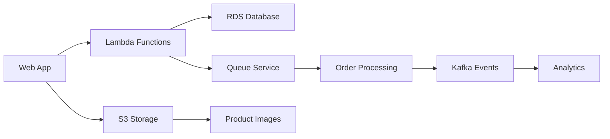
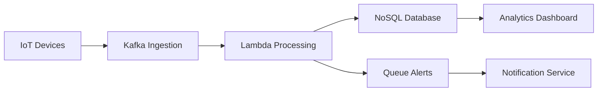
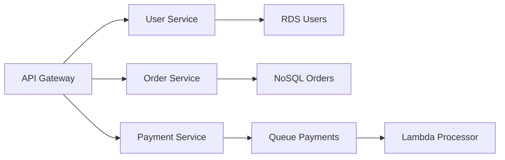

# DockSaaS Developer Quick Start Guide

Este guia fornece uma visão rápida de como começar a usar a DockSaaS API para consumir os serviços AWS-like.

## ?? Início Rápido

### 1. Autenticação

Primeiro, obtenha seu token JWT fazendo login:

```bash
curl -X POST "https://localhost:7000/api/auth/login" \
  -H "Content-Type: application/json" \
  -d '{
    "email": "admin@docksaas.com",
    "password": "Admin123!",
    "tenantName": ""
  }'
```

### 2. Listar Serviços Disponíveis

```bash
curl -X GET "https://localhost:7000/api/services/definitions" \
  -H "Authorization: Bearer {your-jwt-token}"
```

### 3. Criar uma Instância de Serviço

```bash
curl -X POST "https://localhost:7000/api/services/instances" \
  -H "Authorization: Bearer {your-jwt-token}" \
  -H "Content-Type: application/json" \
  -d '{
    "name": "my-storage",
    "serviceDefinitionId": "{service-definition-id}",
    "configuration": "{\"bucketName\": \"my-bucket\", \"encryption\": true}",
    "usageQuota": 10737418240
  }'
```

---

## ?? Serviços Disponíveis

| Serviço | Tipo | Descrição | Casos de Uso |
|---------|------|-----------|--------------|
| ??? **S3 Storage** | `S3Storage` | Object storage com buckets | Arquivos, backups, CDN |
| ??? **RDS Database** | `RDSDatabase` | Banco relacional gerenciado | Apps web, sistemas transacionais |
| ?? **NoSQL Database** | `NoSQLDatabase` | Banco NoSQL tipo DynamoDB | Apps móveis, IoT, analytics |
| ?? **Queue Service** | `Queue` | Filas de mensagens tipo SQS | Microservices, processamento assíncrono |
| ? **Lambda Functions** | `Function` | Computação serverless | APIs, processamento de eventos |
| ?? **Apache Kafka** | `Kafka` | Streaming de dados | Real-time analytics, event sourcing |

---

## ?? Exemplos Rápidos por Serviço

### S3 Storage - Upload de Arquivo

```bash
# 1. Criar bucket
curl -X POST "https://localhost:7000/api/s3storage/{tenant-id}/{service-id}/buckets" \
  -H "Authorization: Bearer {token}" \
  -H "X-API-Key: {api-key}" \
  -H "Content-Type: application/json" \
  -d '{"name": "documents", "encryption": true}'

# 2. Upload arquivo
curl -X POST "https://localhost:7000/api/s3storage/{tenant-id}/{service-id}/buckets/documents/objects" \
  -H "Authorization: Bearer {token}" \
  -H "X-API-Key: {api-key}" \
  -F "file=@document.pdf" \
  -F "key=docs/important.pdf"
```

### RDS Database - Criar e Popular Tabela

```bash
# 1. Criar tabela
curl -X POST "https://localhost:7000/api/rdsdatabase/{tenant-id}/{service-id}/tables" \
  -H "Authorization: Bearer {token}" \
  -H "X-API-Key: {api-key}" \
  -H "Content-Type: application/json" \
  -d '{
    "tableName": "users",
    "schema": {
      "id": "SERIAL PRIMARY KEY",
      "name": "VARCHAR(255) NOT NULL",
      "email": "VARCHAR(255) UNIQUE"
    }
  }'

# 2. Inserir dados
curl -X POST "https://localhost:7000/api/rdsdatabase/{tenant-id}/{service-id}/tables/users/rows" \
  -H "Authorization: Bearer {token}" \
  -H "X-API-Key: {api-key}" \
  -H "Content-Type: application/json" \
  -d '{"name": "João Silva", "email": "joao@email.com"}'
```

### NoSQL Database - CRUD Operações

```bash
# 1. Criar tabela
curl -X POST "https://localhost:7000/api/nosqldatabase/{tenant-id}/{service-id}/tables" \
  -H "Authorization: Bearer {token}" \
  -H "X-API-Key: {api-key}" \
  -H "Content-Type: application/json" \
  -d '{
    "tableName": "products",
    "keySchema": [{"attributeName": "id", "keyType": "HASH"}],
    "attributeDefinitions": [{"attributeName": "id", "attributeType": "S"}]
  }'

# 2. Inserir item
curl -X POST "https://localhost:7000/api/nosqldatabase/{tenant-id}/{service-id}/tables/products/items" \
  -H "Authorization: Bearer {token}" \
  -H "X-API-Key: {api-key}" \
  -H "Content-Type: application/json" \
  -d '{
    "item": {
      "id": {"S": "prod123"},
      "name": {"S": "Notebook"},
      "price": {"N": "2500.00"}
    }
  }'
```

### Queue Service - Envio e Recebimento

```bash
# 1. Criar fila
curl -X POST "https://localhost:7000/api/queue/{tenant-id}/{service-id}/queues" \
  -H "Authorization: Bearer {token}" \
  -H "X-API-Key: {api-key}" \
  -H "Content-Type: application/json" \
  -d '{"queueName": "orders", "queueType": "Standard"}'

# 2. Enviar mensagem
curl -X POST "https://localhost:7000/api/queue/{tenant-id}/{service-id}/queues/orders/messages" \
  -H "Authorization: Bearer {token}" \
  -H "X-API-Key: {api-key}" \
  -H "Content-Type: application/json" \
  -d '{"messageBody": "{\"orderId\": 123, \"amount\": 99.99}"}'

# 3. Receber mensagens
curl -X GET "https://localhost:7000/api/queue/{tenant-id}/{service-id}/queues/orders/messages?maxNumberOfMessages=5" \
  -H "Authorization: Bearer {token}" \
  -H "X-API-Key: {api-key}"
```

### Lambda Functions - Deploy e Execução

```bash
# 1. Criar função
curl -X POST "https://localhost:7000/api/function/{tenant-id}/{service-id}/functions" \
  -H "Authorization: Bearer {token}" \
  -H "X-API-Key: {api-key}" \
  -H "Content-Type: application/json" \
  -d '{
    "functionName": "order-processor",
    "runtime": "dotnet8",
    "handler": "OrderProcessor.Handler",
    "code": "UEsDBAoAAAAAAKxW...",
    "timeout": 30,
    "memorySize": 256
  }'

# 2. Invocar função
curl -X POST "https://localhost:7000/api/function/{tenant-id}/{service-id}/functions/order-processor/invoke" \
  -H "Authorization: Bearer {token}" \
  -H "X-API-Key: {api-key}" \
  -H "Content-Type: application/json" \
  -d '{"payload": {"orderId": 123, "action": "process"}}'
```

### Kafka - Produção e Consumo

```bash
# 1. Criar tópico
curl -X POST "https://localhost:7000/api/kafka/{tenant-id}/{service-id}/topics" \
  -H "Authorization: Bearer {token}" \
  -H "X-API-Key: {api-key}" \
  -H "Content-Type: application/json" \
  -d '{
    "name": "user-events",
    "partitions": 3,
    "replicationFactor": 1
  }'

# 2. Produzir mensagem
curl -X POST "https://localhost:7000/api/kafka/{tenant-id}/{service-id}/topics/user-events/messages" \
  -H "Authorization: Bearer {token}" \
  -H "X-API-Key: {api-key}" \
  -H "Content-Type: application/json" \
  -d '{
    "key": "user-456",
    "value": "{\"userId\": 456, \"action\": \"login\"}"
  }'

# 3. Consumir mensagens
curl -X GET "https://localhost:7000/api/kafka/{tenant-id}/{service-id}/topics/user-events/messages?consumerGroup=analytics" \
  -H "Authorization: Bearer {token}" \
  -H "X-API-Key: {api-key}"
```

---

## ?? Testando com Postman

### 1. Importe a Collection

Baixe a collection do Postman: [DockSaaS.postman_collection.json](docs/DockSaaS.postman_collection.json)

### 2. Configure as Variáveis

```json
{
  "base_url": "https://localhost:7000",
  "jwt_token": "{{token obtido no login}}",
  "tenant_id": "{{seu-tenant-id}}",
  "service_id": "{{id-da-instancia-do-servico}}",
  "api_key": "{{chave-api-do-servico}}"
}
```

### 3. Execute os Testes

1. **Authentication** ? Login
2. **Services** ? List Definitions ? Create Instance
3. **{Service Type}** ? Execute operations

---

## ?? API Client (Blazor)

### Métodos Disponíveis

#### Health Check
```csharp
// ? Use this for health checks (returns bool)
bool isHealthy = await ApiClient.CheckHealthAsync();

// ? Don't use this for health endpoint (tries to deserialize JSON)
var health = await ApiClient.GetAsync<object>("health"); // Will throw JSON error!
```

#### GET Requests
```csharp
// Para endpoints que retornam JSON
var services = await ApiClient.GetAsync<List<ServiceDto>>("api/services/definitions");
var user = await ApiClient.GetAsync<UserDto>("api/auth/me");
```

#### POST Requests
```csharp
// Com request e response
var loginResponse = await ApiClient.PostAsync<LoginRequest, LoginResponse>("api/auth/login", loginRequest);

// Com request, sem response
bool success = await ApiClient.PostAsync("api/auth/logout", logoutRequest);

// Sem request, sem response
bool success = await ApiClient.PostAsync("api/services/restart");
```

#### Tratamento de Erros
```csharp
try
{
    var result = await ApiClient.GetAsync<DataDto>("api/data");
    if (result == null)
    {
        // API retornou erro ou dados inválidos
        Logger.LogWarning("API returned null or invalid data");
    }
}
catch (Exception ex)
{
    // Erro de rede, timeout, etc.
    Logger.LogError(ex, "API call failed");
}
```

### Prerendering Safety

O `ApiClient` é seguro para prerendering (SSR):

- **Durante prerendering**: Pula acesso ao localStorage graciosamente
- **Após hidratação**: Funcionalidade completa com tokens
- **Fallback automático**: Usa token manual se localStorage não disponível

```csharp
// Exemplo em um componente Blazor
@code {
    protected override async Task OnAfterRenderAsync(bool firstRender)
    {
        if (firstRender)
        {
            // Safe to call after first render (post-hydration)
            var data = await ApiClient.GetAsync<DataDto>("api/data");
            StateHasChanged();
        }
    }
}
```

---

## ?? SDKs e Bibliotecas

### JavaScript/Node.js

```bash
npm install @docksaas/client
```

```javascript
const { DockSaaSClient } = require('@docksaas/client');

const client = new DockSaaSClient({
  baseURL: 'https://localhost:7000',
  token: 'your-jwt-token'
});

// Exemplo: Upload para S3
const result = await client.s3.uploadObject({
  serviceId: 'service-id',
  bucketName: 'documents',
  key: 'file.pdf',
  file: fs.createReadStream('local-file.pdf')
});
```

### Python

```bash
pip install docksaas-client
```

```python
from docksaas_client import DockSaaSClient

client = DockSaaSClient(
    base_url='https://localhost:7000',
    token='your-jwt-token'
)

# Exemplo: Consulta NoSQL
result = client.nosql.query(
    service_id='service-id',
    table_name='users',
    key_conditions={'id': {'S': 'user123'}}
)
```

### C#

```bash
dotnet add package DockSaaS.Client
```

```csharp
using DockSaaS.Client;

var client = new DockSaaSClient(new DockSaaSClientOptions
{
    BaseUrl = "https://localhost:7000",
    Token = "your-jwt-token"
});

// Exemplo: Enviar mensagem para fila
var result = await client.Queue.SendMessageAsync(new SendMessageRequest
{
    ServiceId = "service-id",
    QueueName = "orders",
    MessageBody = "{\"orderId\": 123}"
});
```

---

## ?? Monitoramento e Métricas

### Dashboard de Métricas

Acesse `https://localhost:7001/dashboard` para visualizar:

- **Uso de recursos** por serviço
- **Métricas de performance**
- **Logs de auditoria**
- **Billing e custos**

### APIs de Métricas

```bash
# Métricas de instância de serviço
curl -X GET "https://localhost:7000/api/services/instances/{service-id}/metrics" \
  -H "Authorization: Bearer {token}"

# Status de saúde
curl -X GET "https://localhost:7000/api/services/instances/{service-id}/status" \
  -H "Authorization: Bearer {token}"
```

---

## ??? Configurações Avançadas

### Configuração de Ambiente

```json
{
  "S3Storage": {
    "bucketName": "my-app-storage",
    "encryption": true,
    "versioning": false,
    "publicAccess": false
  },
  "RDSDatabase": {
    "engine": "postgresql",
    "version": "15.0",
    "maxConnections": 100
  },
  "NoSQLDatabase": {
    "readCapacity": 5,
    "writeCapacity": 5,
    "encryption": true
  },
  "Queue": {
    "queueType": "standard",
    "retentionPeriod": 345600,
    "maxReceiveCount": 10
  },
  "Function": {
    "runtime": "dotnet8",
    "timeout": 30,
    "memory": 128
  },
  "Kafka": {
    "partitions": 3,
    "replicationFactor": 1,
    "retentionHours": 168
  }
}
```

### Webhooks

Configure webhooks para receber notificações:

```bash
curl -X POST "https://localhost:7000/api/tenants/{tenant-id}/webhooks" \
  -H "Authorization: Bearer {token}" \
  -H "Content-Type: application/json" \
  -d '{
    "url": "https://myapp.com/webhooks/docksaas",
    "events": ["service.created", "service.updated", "billing.alert"],
    "secret": "webhook-secret-key"
  }'
```

---

## ?? Troubleshooting

### Problemas Comuns

1. **401 Unauthorized**
   - Verifique se o token JWT está válido
   - Confirme se a API key está correta

2. **404 Not Found**
   - Verifique se o service-id existe
   - Confirme se o tenant-id está correto

3. **429 Rate Limited**
   - Aguarde ou implemente retry com backoff
   - Considere upgrade do plano

4. **500 Internal Error**
   - Verifique logs no dashboard Aspire
   - Consulte a documentação de status

### Logs e Debug

```bash
# Logs da aplicação
curl -X GET "https://localhost:17090" # Aspire Dashboard

# Health check
curl -X GET "https://localhost:7000/health"

# Swagger docs
curl -X GET "https://localhost:7000/swagger"
```

---

## ?? Recursos Adicionais

- **?? Documentação Completa**: [docs/API_EXAMPLES.md](docs/API_EXAMPLES.md)
- **?? Troubleshooting**: `.\scripts\troubleshoot-login.ps1`
- **?? Dashboard**: https://localhost:7001
- **?? Health Check**: https://localhost:7000/health
- **?? API Docs**: https://localhost:7000/swagger

---

## ?? Casos de Uso Práticos

### E-commerce



### IoT Platform



### Microservices



---

## ?? Próximos Passos

1. ? **Autentique-se** e crie uma instância de serviço
2. ? **Teste** os endpoints com os exemplos acima
3. ? **Integre** com sua aplicação usando os SDKs
4. ? **Monitore** o uso e performance no dashboard
5. ? **Configure** webhooks para automação
6. ? **Escale** conforme necessário

---

**?? Happy coding com DockSaaS!**